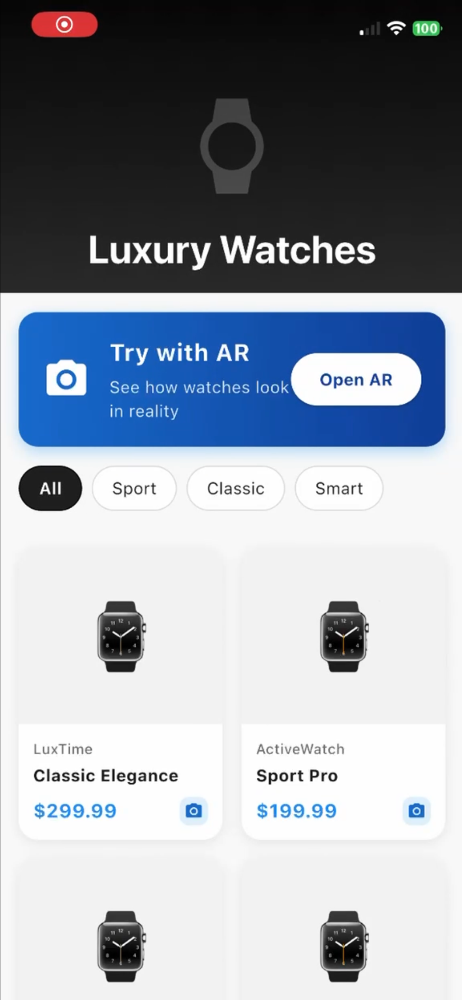

# Watches Store (AR Try-On)

A Flutter mobile application for an watch store featuring **Augmented Reality (AR) try-on** powered by Unity, allowing customers to virtually try watches on their wrist before purchasing.

---

## 📱 Screenshots & Features

[](https://drive.google.com/file/d/13n5WpyjaHCPFncxwfXCUXYoqBjMuWfRZ/view?usp=sharing)

---

## ✨ Features

- 🛍️ **Product Catalog** — Browse watches in a responsive 2-column grid with images, brand, name, and price in Egyptian Pounds (ج.م)
- 🔍 **Watch Detail Page** — Full product view with description, price, authenticity badge
- 📦 **Category Filtering** — Tabs for All, Sport, Classic, Smart, and Luxury categories
- 📷 **AR Try-On** — Integrated Unity AR view that uses a printed marker to overlay a 3D watch model on the user's wrist in real time
- 🖨️ **AR Marker Download** — In-app dialog to view and screenshot the AR marker image required for the Unity AR session
- 🛒 **Add to Cart** — Snackbar feedback when adding a watch to the cart

---

## 📦 Dependencies

```yaml
dependencies:
  flutter:
    sdk: flutter
  flutter_unity_widget_2: ^<latest>   # Unity AR integration
```

> ⚠️ **`flutter_unity_widget_2`** requires a Unity build exported as an Android/iOS library and embedded in the Flutter project. See [Setup](#-unity-ar-setup) below.

---

## 🚀 Getting Started

### Prerequisites

- Flutter SDK `>=3.0.0`
- Android Studio or Xcode
- Unity `2021.3 LTS` or later (for building the AR module)
- A physical device (AR camera features don't work on emulators)

### Installation

```bash
# 1. Clone the repository
git clone https://github.com/SalmaHeshamm/Smartwatch-Store-with-AR-Try-On-Flutter-Unity-.git
cd Smartwatch-Store-with-AR-Try-On-Flutter-Unity

# 2. Install Flutter dependencies
flutter pub get

# 3. Run on a connected device
flutter run
```

---

## 🧩 Unity AR Setup

The AR experience is powered by Unity embedded inside Flutter via `flutter_unity_widget_2`.

### Steps

1. **Create or open your Unity AR project** — Set up AR Foundation with a marker-based tracker targeting the provided marker image.

2. **Export the Unity project** as an Android Library (`.aar`) or iOS Framework:
   - Go to **File → Build Settings**
   - Select your platform
   - Enable **Export Project**
   - Build

3. **Embed the Unity build into Flutter:**
   - Place the exported Unity output inside the Flutter project under `unityLibrary/` (Android) or `UnityFramework.framework` (iOS)
   - Follow the [flutter_unity_widget_2 integration guide](https://pub.dev/packages/flutter_unity_widget_2)


